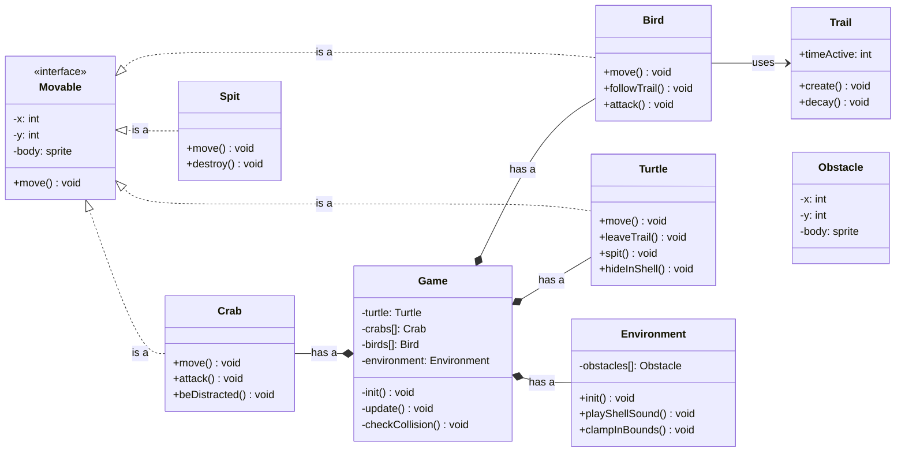

# CRC

----------------------------------

# UML Diagram

```mermaid
classDiagram

    direction RL

    class Game{
        -turtle: Turtle
        -crabs[]: Crab
        -birds[]: Bird
        -environment: Environment

        -init() void
        -update() void
        -checkCollision() void
    }

    class Movable{
        <<interface>>

        -x: int
        -y: int
        -body: sprite

        +move() void
    }

    class Crab{
        +move() void
        +attack() void
        +beDistracted() void
    }

    class Bird{
        +move() void
        +followTrail() void
        +attack() void
    }

    class Turtle{
        +move() void
        +leaveTrail() void
        +spit() void
        +hideInShell() void
    }

    class Spit{
        +move() void
        +destroy() void
    }

    class Trail{
        +timeActive: int

        +create() void
        +decay() void
    }


    class Environment{
        -obstacles[]: Obstacle

        +init() void
        +playShellSound() void
        +clampInBounds() void
    }

    class Obstacle{
        -x: int
        -y: int
        -body: sprite
    }

    

    Crab ..|> Movable : is a 
    Game *-- Crab : has a
    
    Bird ..|> Movable : is a 
    Bird --* Game : has a
    Trail <--Bird : uses


    Turtle ..|> Movable : is a 
    Turtle --* Game : has a
    
    Spit ..|> Movable : is a 

    Environment --* Game : has a
```
