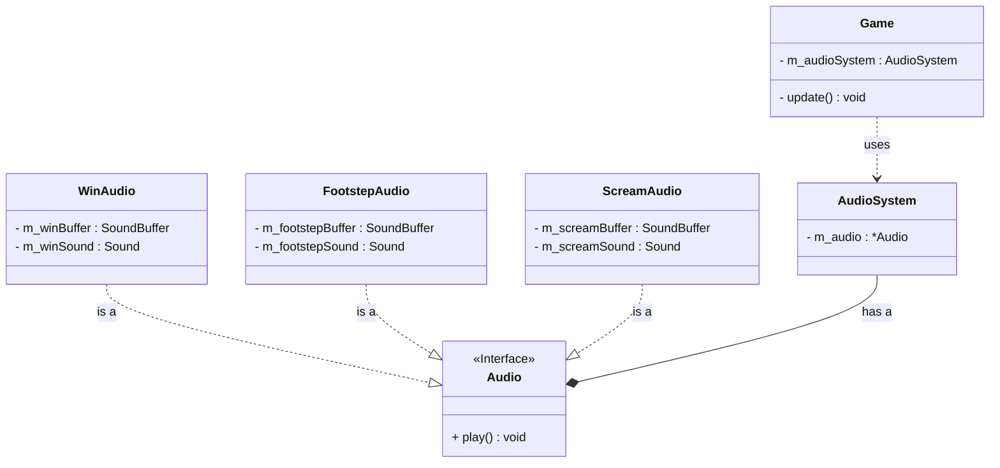
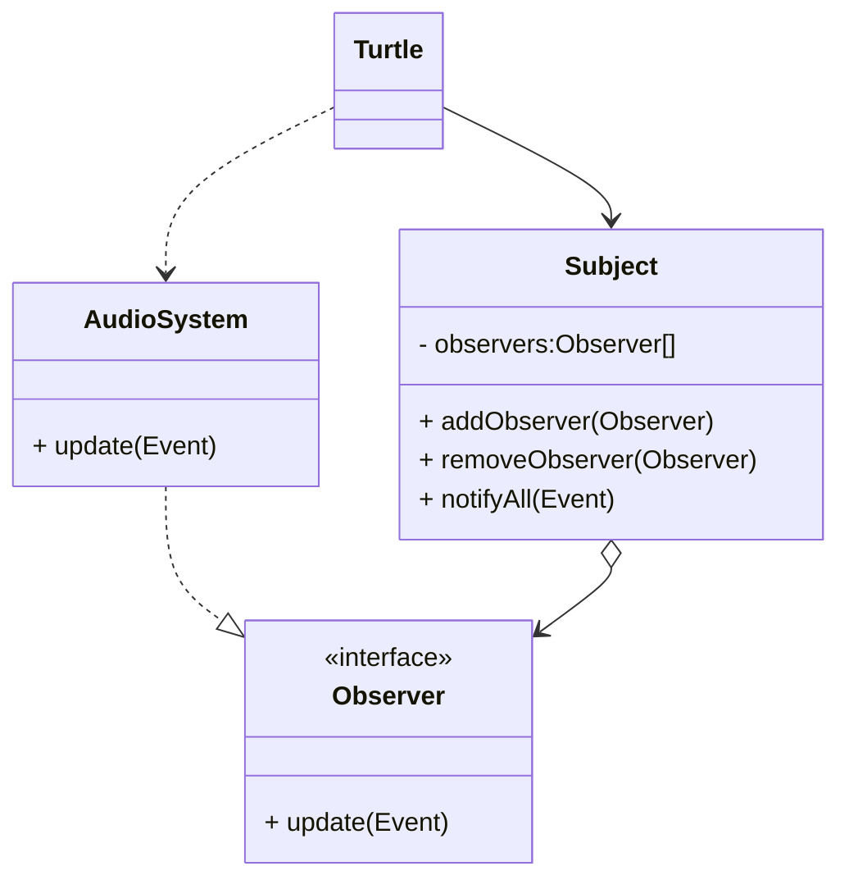

# Strategy Pattern

```mermaid
classDiagram

    class Game{
        - m_audioSystem : AudioSystem

        - update()  void
    }

    class AudioSystem {
	      - m_audio : *Audio
    }


    class Audio <<Interface>>{
        + play() void
    }

    class WinAudio{
	    - m_winBuffer : SoundBuffer 
      - m_winSound : Sound 
    }

    class FootstepAudio{
	    - m_footstepBuffer : SoundBuffer 
	    - m_footstepSound : Sound 
    }

    class ScreamAudio{
      - m_screamBuffer : SoundBuffer 
	    - m_screamSound : Sound 
    }


    WinAudio ..|> Audio : is a 
    FootstepAudio ..|> Audio : is a
    ScreamAudio ..|> Audio : is a

    AudioSystem --* Audio : has a
    Game ..>  AudioSystem : uses
```

----------------------------------

# Observer Pattern

```mermaid
classDiagram

    class Observer <<interface>> {
        + update(Event)
    }

    class Subject{
        - observers:Observer[]
        + addObserver(Observer)
        + removeObserver(Observer)
        + notifyAll(Event)
    }


    AudioSystem ..|> Observer

    class AudioSystem{
        + update(Event)
    }

    Subject o-->Observer
    Turtle --> Subject 
    Turtle ..> AudioSystem
```
