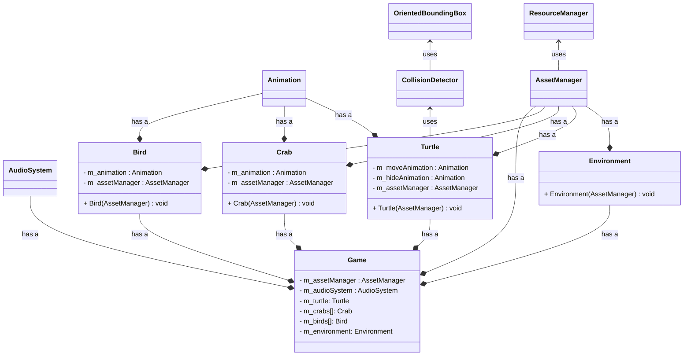
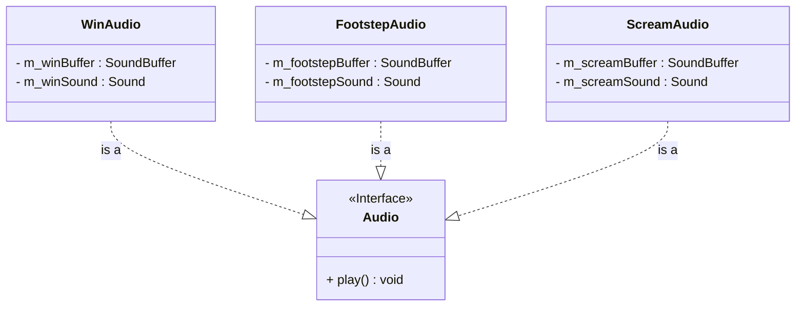
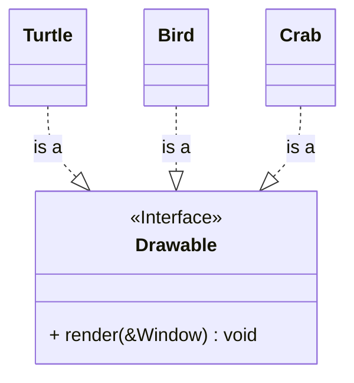
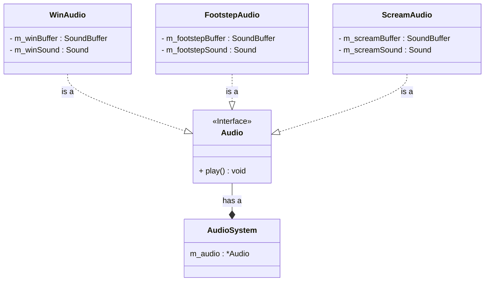

# Single Responsibility Principle (SRP)

Implementing SRP helped our coding process extremely well. 
For starters, we were able to avoid much merge conflicts due to isolation of code chunks.

Then, we had specific classes for features that were needed purely because we are in a software system.
For example, there were classes like Animation, CollisionDetector, ResourceManager, etc which 
were seperated from entities because we only wanted the entity classes to encase it's intrinsic behaviour.

----------------------------------

# Open Closed Principle (OCP)

Implementing OCP was fairly intuitive for us. 
From the beginning, we made sure to write code that didn't have to be modified. 

For example, we had written an 'Animation' class that dealt with implementing animation. 
After some changes in our code, we realized this class had difficluties integrating into an animation FSM.
Fortunately, since we followed OCP, all the code we had done upto then needn't change and 
we just had to make a new function.

Another example is that Strategy Pattern is implemented in handling audio for the game.
This meant that in order to add a new audio, we simply create a class for that and not modify any existing code.

Yet another example is that each entity in game were themselves responsible for rendering rather than having
code in game class that perhaps dealt with an ever-modifying switch statement.

----------------------------------

# Dependency Inversion Principle (DIP)

DIP is the only principle that we felt wasn't suitable for our game.
Implementing it caused our program to be more complex without any return on investtment.

As soon as we noticed the incompatability, we didn't further adhere to it.

The one place we did implement it is removing the dependency for AudioSystem.
The 'Audio' class is the abstraction that the high level module (AudioSystem) and the 
low level module (WinAudio/ScreamAudio/FootstepAudio) depend on.

